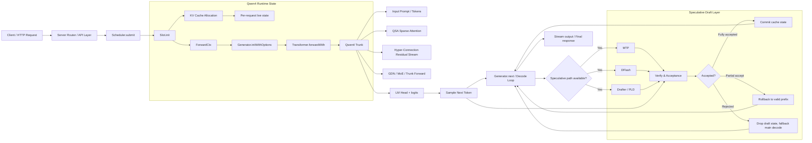

# Qwen4 + Scheduler + KV Cache 最终版架构总图（中文）

这页文档把前面所有内容压成一张“一页版总图”，目标是让你一眼看到：

- 请求入口在哪里
- scheduler 在做什么
- KV cache 和 slot 是怎么持有生成状态的
- Qwen4 主干前向怎么工作
- speculative draft / verify / rollback 怎么嵌进 runtime

---

## 一、总图：一页版架构图



---

## 二、主链阅读顺序

如果你只看主链，最关键的一条路就是：

```text
Client -> Scheduler.submit -> Slot.init -> KV Cache + ForwardCtx -> Generator.initWithOptions -> Transformer.forwardWith -> Qwen4 Trunk -> Generator.next -> decode loop -> commit / rollback -> next token
```

这条链路就是整个 Qwen4 runtime 的骨架。

---

## 三、最关键的三个事实

### 1. slot 是生成状态的真实容器

不是模型全局单例，而是每个请求一个 `Slot`，里面保存：

- KV cache
- `ForwardCtx`
- token 进度
- prompt / decode 状态
- speculative draft 状态

### 2. Qwen4 不是简单 transformer

核心在于：

- `QSA` 稀疏注意力
- `hyper-connection` 附加残差流
- `GDN / MoE` 处理 trunk
- `LM head` 给出 logits

### 3. speculative draft 不是独立生成器

它只是：

- 在当前上下文上先猜一段未来 token
- 交给 `Verify` 判断是否可接收
- 接受则 commit；不接受则 rollback

最终还是回到主干 decode 继续推进。

---

## 四、最终一句话总结

> Qwen4 的本质运行结构是：scheduler 创建 slot + KV cache → prefill 建立 live state → transformer 执行 Qwen4 trunk → decode loop 逐 token推进 → speculative draft 在中间插入 verify 和 rollback → 最终 commit 当前正确前缀并继续下一轮生成。

这就是 mlx-serve 中 Qwen4 + Scheduler + KV Cache 的最终版架构总图。
