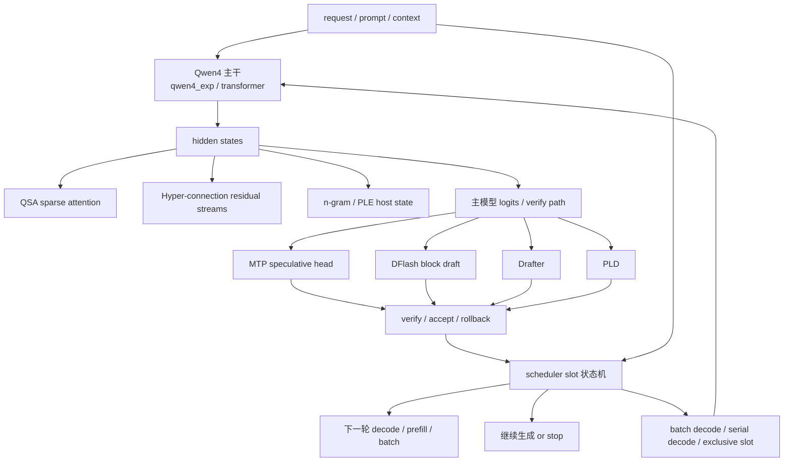

# Qwen4 / MTP / DFlash / Drafter 之间的综合关系图（中文）

这篇文档把项目里的几个关键“加速与生成增强机制”放在同一张图里看：

- Qwen4 的架构特征
- MTP speculative decoding
- DFlash block draft
- Drafter / PLD 等配套 draft 机制
- scheduler 是如何把它们统筹起来的

核心目标：把它们从“几个不同文件里的独立功能”整理成一张统一的运行时关系图。

相关源码：

- [../src/qwen4_exp.zig](../src/qwen4_exp.zig)
- [../src/mtp.zig](../src/mtp.zig)
- [../src/dflash.zig](../src/dflash.zig)
- [../src/drafter.zig](../src/drafter.zig)
- [../src/pld_index.zig](../src/pld_index.zig)
- [../src/scheduler.zig](../src/scheduler.zig)
- [../src/generate.zig](../src/generate.zig)
- [../src/transformer.zig](../src/transformer.zig)

---

## 一、先说结论

如果用一句话概括：

> Qwen4 不是单一的“模型增强”，而是“主干模型 + 稀疏 attention + hyper stream + spec draft 头 + 调度器状态管理”一起工作的复杂生成系统。

其中：

- Qwen4 主干负责语义计算
- QSA / n-gram / hyper-connection 提供额外结构性信息
- MTP、DFlash、Drafter、PLD 负责 spec generation 侧链
- scheduler 负责决定“哪些 draft 路径在当前 slot 上生效、是否验证、是否接受、是否回滚”

它们不是互斥关系，而是同一套生成时序里的不同层次：

- 结构层：Qwen4 trunk
- 记忆层：QSA / n-gram / hyper stream
- draft 层：Drafter / DFlash / MTP / PLD
- 调度层：scheduler

---

## 二、统一关系图



---

## 三、每一个模块分别负责什么

### 1) Qwen4：核心生成主干

Qwen4 的主干不是“一个纯粹的 transformer 只负责 logits 输出”，而是一套更复杂的运行时结构。

它本身包括：

- qwen3_5 风格的 GDN + MoE trunk
- hyper-connection streams
- sparse QSA attention
- n-gram / PLE 之类的 host-side辅助状态

所以 Qwen4 不是单一模型，而更像是：

> 主干 + 额外信息通道 + spec 生成头 的组合架构。

---

### 2) MTP：模型内置的 spec draft head

MTP 在架构上是“模型自己的下一步预测头”。

它的特点是：

- 不是最终输出头那种普通 lm_head
- 它更像是一个可校验的 future-token proposer
- 可以提前生成一批 token
- 然后由 verify 路径确认

在项目中，MTP 还非常强调：

- `slotExclusiveDecode`
- 其状态与 scheduler 的 slot 绑定
- 它不是随便可用的，必须遵循 runtime 规则

所以它更像：

> 模型内部的“下一步 speculative proposer”。

---

### 3) DFlash：块级 speculative draft

DFlash 的重点不是“一个 token 一个 token 猜”，而是：

- 以 block 为单位
- 一次生成一段候选区间
- 这个区间长度由 `block_size` 控制
- 然后通过 verify 进行接受判断

它属于 spec draft，但它偏“块级 / block-wise”。

DFlash 的关键特征：

- 依赖 config contract
- 采用 assistant forward 侧链
- 需要 capture / cache / rollback 机制
- 适合高吞吐、多 token 预测场景

它和 MTP 的区别可以概括为：

- MTP：模型内置的 speculative head
- DFlash：更偏 block-drafter / 侧链 draft 机制

---

### 4) Drafter：更通用的 draft 分支

Drafter 一般是更通用的 spec draft 路径，典型特征：

- 由一个辅助 forward 提供候选 token
- 通过 verify 判断这些 token 是否应该接受
- 维持生成状态的连续性

它和 DFlash 的关系很接近，但不是完全一样：

- DFlash 更强调 block 级的 draft contract
- Drafter 更偏通用 draft 路径 / sidecar draft 机制

---

### 5) PLD：历史模式匹配式 draft

PLD 的思想不同于 MTP / DFlash：

- 不是模型自身预测下一步
- 而是用历史复现或 n-gram / repetition pattern 做候选 token 召回

它的关键是：

- 直接从历史中找相似/重复模式
- 作为 draft 候选
- 再走验证

因此它更像：

> 历史模式匹配的 speculative draft

---

## 四、它们之间的层次关系

可以把它们看成三层：

### 1) 基础语义层：Qwen4 trunk

这里负责真正的上下文理解与表达生成。

其输出是“真实语义状态”，而不是纯 draft 候选。

### 2) draft 层：MTP / DFlash / Drafter / PLD

这些机制都围绕“先猜一段，再验证”展开。

它们的区别：

- MTP：模型内置 head
- DFlash：block-wise draft
- Drafter：较通用的辅助 draft
- PLD：基于历史模式匹配

### 3) 调度层：scheduler

这是整套系统的控制中枢。

scheduler 决定：

- 当前 slot 是否允许 speculate
- 当前 slot 是否需要 serial decode
- draft 是否需要 verify
- accepted / rejected 数量如何推进
- cache / KV / hidden state 是否需要 rollback

没有 scheduler，这些 draft route 都只是“孤立的前向逻辑”，无法真正协同工作。

---

## 五、真正的协同方式

实际运行时的主路径并不是“只选一个 spec 路径”。

更接近的是：

```text
Qwen4 trunk 产出状态
    ↓
多个 draft 路径并行或分层尝试
    ↓
scheduler 选择需要启用的 path
    ↓
verify / accept / rollback
    ↓
继续下一轮 decode
```

也就是说：

- Qwen4 主干决定“真实状态”
- draft 路径决定“预测候选”
- scheduler 决定“哪些候选值得相信、如何推进状态”

这才是项目里 speculative generation 的真实结构。

---

## 六、最简记忆版

如果你只记一个结论：

```text
Qwen4 负责主语义计算，
MTP / DFlash / Drafter / PLD 负责 speculative draft，
scheduler 负责统一调度与状态控制。
```

换成更准确一点的说法：

```text
Qwen4 是主干；
MTP/DFlash/Drafter/PLD 是生成前端的预测机制；
scheduler 是生成时序与状态机的总管。
```

---

## 七、推荐继续阅读顺序

建议按这个顺序继续读源码：

1. [../src/qwen4_exp.zig](../src/qwen4_exp.zig)
2. [../src/mtp.zig](../src/mtp.zig)
3. [../src/dflash.zig](../src/dflash.zig)
4. [../src/drafter.zig](../src/drafter.zig)
5. [../src/pld_index.zig](../src/pld_index.zig)
6. [../src/scheduler.zig](../src/scheduler.zig)
7. [../src/generate.zig](../src/generate.zig)

这样你会更容易把：

- 架构
- spec draft
- runtime 状态
- 验证与回滚

串起来看成一个整体。

---

## 八、一个最终判断

Qwen4 + MTP + DFlash + Drafter 的综合结构，最核心的价值不是单独某个模块跑得多快，而是：

> 在同一个生成时序里，把主干计算、候选预测、验证确认、状态回滚、批量调度统一起来。

这也是为什么它们在 mlx-serve 里不是分散的“优化点”，而是同一套生成系统内部的不同层次。
