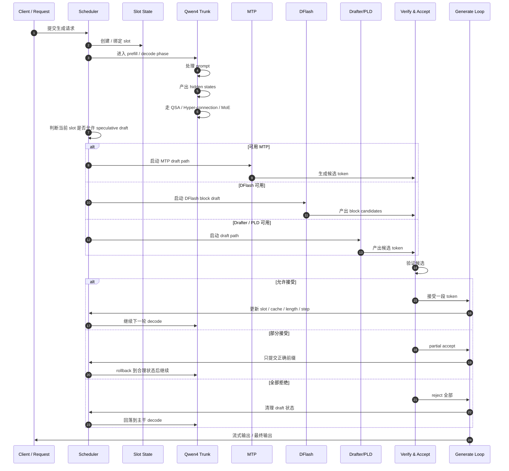
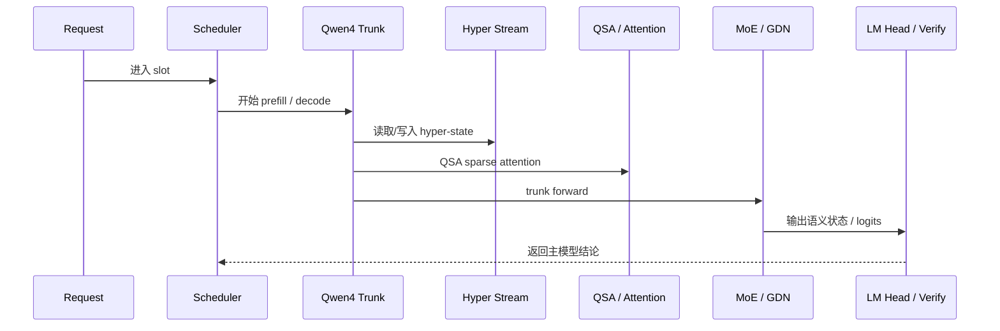
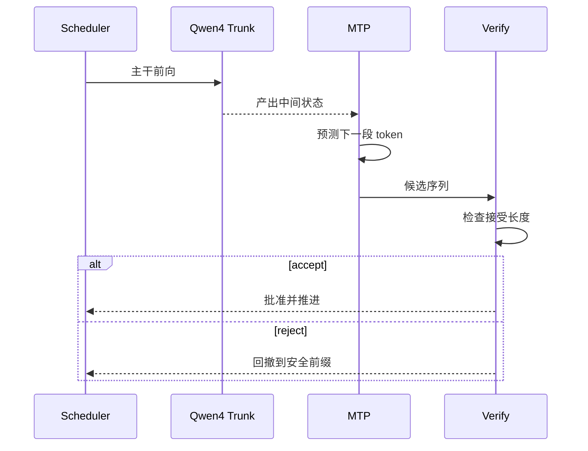
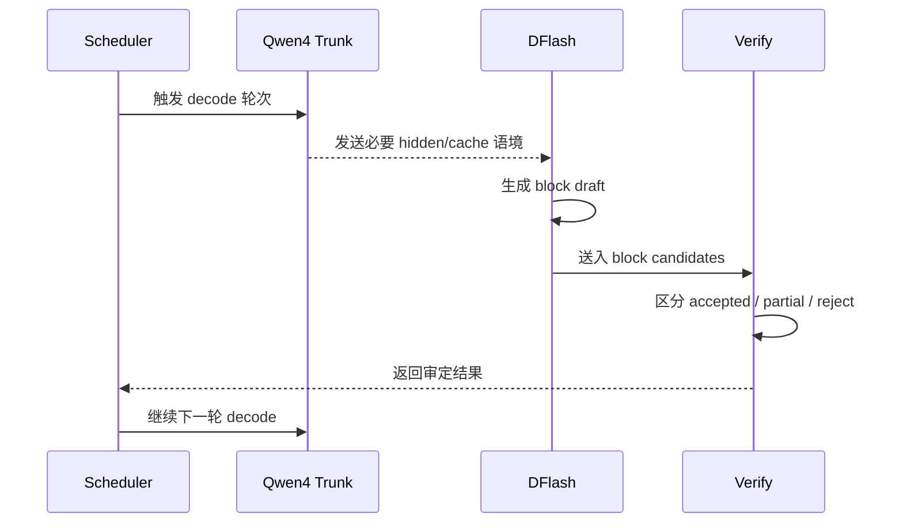
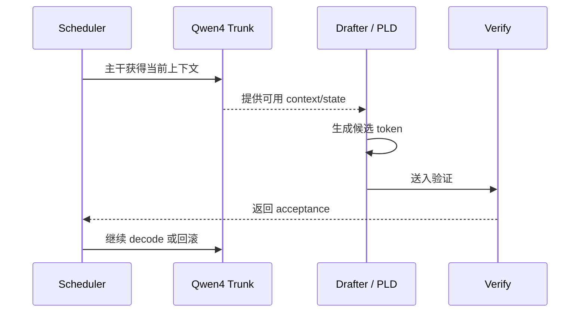
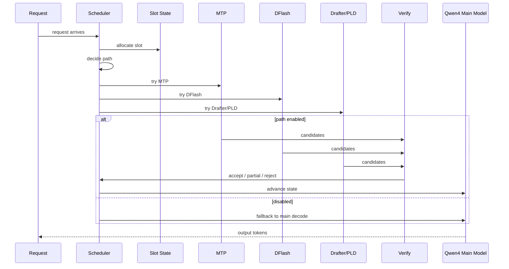
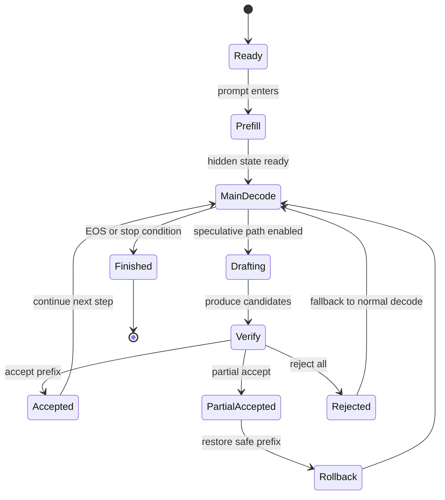

# Qwen4 + MTP + DFlash + Scheduler 的时序图版（中文）

这篇文档把前面的架构总结进一步落成一张“时间顺序”视图，重点展示：

- 一个请求如何进入生成流程
- Qwen4 trunk 是如何开始工作的
- MTP、DFlash、Drafter / PLD 这几条 spec path 如何参与
- scheduler 如何控制 accept / reject / rollback
- 一个 token 生成链路在时间上是怎么串起来的

核心目标：把“系统结构图”变成“运行时时序图”。

相关源码：

- [../src/qwen4_exp.zig](../src/qwen4_exp.zig)
- [../src/mtp.zig](../src/mtp.zig)
- [../src/dflash.zig](../src/dflash.zig)
- [../src/drafter.zig](../src/drafter.zig)
- [../src/pld_index.zig](../src/pld_index.zig)
- [../src/scheduler.zig](../src/scheduler.zig)
- [../src/generate.zig](../src/generate.zig)
- [../src/transformer.zig](../src/transformer.zig)

---

## 一、总览：一次生成的时间顺序



---

## 二、这张图的核心含义

这不是一个“某个模块单独做事”的流程，而是一整套生成时序：

- 协作的对象不止一个
- 生成并不是一个线性单一路径
- 真正的发散点在于：draft 路径和主干 decode 是否要并行、验证、回滚

核心结构是：

```text
request -> slot -> qwen4 trunk -> draft path -> verify -> accept/rollback -> next decode
```

---

## 三、Qwen4 在时序中的位置

Qwen4 的主干并不是“最后再做一次 logits 输出”，它在整个流水线中位于中间关键节点：



这里的关键点是：

- Qwen4 并不只是一个线性的 transformer 前向
- 它在前向过程中还会处理额外状态流和稀疏注意力
- 所以它本身就在生成时序中提供了“更复杂的上下文表征”

---

## 四、MTP 在时序中的角色

MTP 是“模型自带的 speculative proposer”。

它更像是：

> 在主干语义输出之后，立刻启动下一步未来 token 的预测



最重要的一点：

- MTP 并不是“替代主干生成”
- 它是“在主干状态上额外投出候选 future token”
- 它最终仍然要交给 verify 路径确定是否成真

---

## 五、DFlash 在时序中的角色

DFlash 是一个“块级 speculative draft”机制，时间上通常出现为：

- 主干状态准备好
- DFlash 启动一批 block-level 预测
- 再由 verify 判断 block 中哪些 token 真正可以接收



这里的关键不是“一个 token 一次猜”，而是：

- block 调度
- batch-like speculative forward
- partial accept 的状态化管理

---

## 六、Drafter / PLD 在时序中的位置

Drafter 和 PLD 更偏“辅助 speculative 路径”，它们的时序通常类似：



它们之间的区别可以理解为：

- MTP：模型内置的 future-head
- DFlash：block 级 draft
- Drafter：通用 draft 分支
- PLD：历史模式匹配式 draft

它们都参与同一个总体时序：

```text
主干状态 -> draft 候选 -> verify -> accept/reject -> 下一轮状态推进
```

---

## 七、scheduler 是真正的总控器

最关键的一点是：

> 整个 spec draft 体系并不是“谁先跑谁赢”，而是 scheduler 决定它们在当前 slot 上的有效性与优先级。



Scheduler 在这里承担的角色包括：

- slot 分配
- prefill / decode phase 切换
- 路径是否启用
- candidate 是否要验证
- 验证后是否接受或回滚
- batch / serial / exclusive decode 之间的协调

---

## 八、实际的一轮生成状态机



这张状态机解释了为什么 spec draft 并不是“只看速度”，而是一套状态一致性的系统：

- 需要知道候选哪些被接受
- 哪些需要回滚
- 哪些要保留 prefix
- 下一轮 decode 从哪里继续

---

## 九、一个更接近真实的串联理解

真实运行顺序可以理解为：

```text
Client request
  -> Scheduler creates slot
  -> Qwen4 trunk prefill / decode
  -> choose speculative path (MTP / DFlash / Drafter / PLD)
  -> generate candidate token(s)
  -> verify candidate(s)
  -> accept some / partial accept / reject all
  -> update KV cache + slot state
  -> continue main decode
  -> stream output to client
```

这说明：

> Qwen4 + MTP + DFlash + Scheduler 本质上是一个“主干 + 预测 + 验证 + 调度”的统一生成闭环。

---

## 十、最简记忆版

如果你只记一张图：

```text
Request
  -> Scheduler
      -> Slot
      -> Qwen4 trunk
          -> hidden states / attention / hyper-stream
      -> MTP / DFlash / Drafter / PLD
          -> draft candidates
      -> Verify
          -> accept / partial / reject
      -> Update cache & state
      -> Continue next decode
```

这就是 Qwen4 与 spec draft 体系的真正时序逻辑。

---

## 十一、推荐继续阅读

继续深入时，最值得按这个顺序看源码：

1. [../src/scheduler.zig](../src/scheduler.zig)
2. [../src/qwen4_exp.zig](../src/qwen4_exp.zig)
3. [../src/mtp.zig](../src/mtp.zig)
4. [../src/dflash.zig](../src/dflash.zig)
5. [../src/drafter.zig](../src/drafter.zig)
6. [../src/pld_index.zig](../src/pld_index.zig)
7. [../src/generate.zig](../src/generate.zig)

这样你会最容易读懂：

- 什么时候进入 draft
- draft 如何验证
- 何时 accept / partial accept / reject
- 为什么 scheduler 是整个系统的核心控制层

---

## 十二、最后一句话

Qwen4 的真正力量，不在于“模型变大”这么表面，而在于：

> 它把主干生成、speculative draft、状态回滚、slot 调度整合成了一套统一的 runtime 时序。

这一点正是 mlx-serve 这套系统最有价值的地方。
