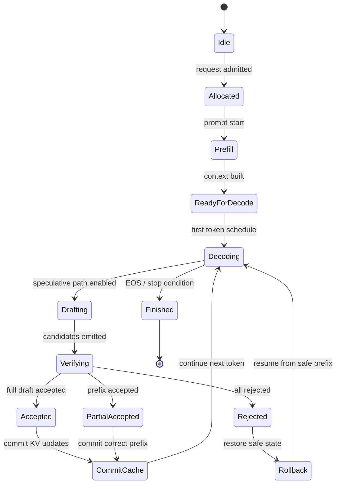

# Qwen4 + Scheduler + KV Cache + rollback 的状态机版（中文）

这篇文档把 Qwen4 的运行时抽象成一个状态机，重点讲清楚：

- slot 是如何进入和退出生成状态的
- Qwen4 主干如何在 scheduler 下运行
- KV cache 在 prefill / decode / speculative draft 中如何更新
- accept / partial accept / reject 对 cache 的影响
- rollback 在什么条件下触发，以及如何恢复正确状态

核心目标：把“Qwen4 的结构”升级成“动起来的状态机”。

相关源码：

- [../src/qwen4_exp.zig](../src/qwen4_exp.zig)
- [../src/scheduler.zig](../src/scheduler.zig)
- [../src/generate.zig](../src/generate.zig)
- [../src/transformer.zig](../src/transformer.zig)
- [../src/mtp.zig](../src/mtp.zig)
- [../src/dflash.zig](../src/dflash.zig)

---

## 一、先给结论

Qwen4 这条路径的关键不在于单一模型参数，而在于：

> 它必须在 scheduler 的状态机控制下管理缓存与回滚，才能保证生成过程的一致性。

如果把它看成一个状态机，它的核心逻辑就是：

```text
Ready
  -> Prefill
  -> Decode
      -> Draft Candidate
      -> Verify
          -> Accept
          -> Partial Accept
          -> Reject
      -> Commit Cache or Rollback Cache
      -> Continue Decode
```

---

## 二、最核心的抽象：slot + cache + verify

在这个项目中，Qwen4 并不是“裸奔地生成”。

它运行在一套 slot-based runtime 之中，slot 负责：

- 当前请求的上下文长度
- 当前生成位置
- 是否在 prefill 或 decode 模式
- 是否走 speculative draft
- 是否需要回滚

KV cache 则负责：

- 保存 key/value 历史状态
- 让后续 token 在 decode 阶段不必重新计算整段历史
- 配合 draft 和 verify 逻辑推进生成

而 rollback 则负责：

- 当 speculative 分支产生错误候选时，回到安全前缀
- 保证系统状态和正确输出一致

---

## 三、状态机总图



---

## 四、状态的含义

### 1) Idle

表示 slot 还没有承载真实请求。

### 2) Allocated

表示请求已经被 scheduler 指派到某个 slot，但是还没有真正开始生成。

### 3) Prefill

在这个阶段，模型会处理 prompt 上下文，建立前缀状态，并写入 KV cache。

这是“构建可复用历史”的时刻。

### 4) ReadyForDecode

prefill 完成，模型已经具备生成基础状态，等待下一轮 token 产生。

### 5) Decoding

正常生成阶段。此时模型根据当前上下文和缓存生成下一 token。

### 6) Drafting

如果启用了 spec 机制（如 MTP / DFlash / Drafter / PLD），会先生成候选 token，而不是直接承诺最终输出。

### 7) Verifying

验证阶段检查这些 candidate 是否成立，决定：

- 全部接受
- 部分接受
- 全部拒绝

### 8) Accepted

全部候选都视为有效，缓存和 slot 继续推进。

### 9) PartialAccepted

只有前缀有效，后续 candidate 要被截断并回滚到安全前缀。

### 10) Rejected

当前 draft 无效，系统回到正常主干 decode 或安全的旧状态。

### 11) Rollback

这是整个系统的关键安全状态：

- cache 需要恢复到一个可继续生成的位置
- 当前 slot 的上下文长度恢复到正确值
- 生成继续从有效前缀开始

---

## 五、KV Cache 的生命周期

KV cache 在这个状态机里不是“一个最终对象”，而是一个不断变动的状态：

```mermaid
flowchart LR
    A[Prefill Cache Build] --> B[Decode Cache Continuation]
    B --> C[Draft Candidate Cache
(provisional)]
    C --> D{Verify outcome}
    D -->|Accepted| E[Commit to main cache]
    D -->|Partial| F[Truncate to valid prefix]
    D -->|Rejected| G[Discard provisional state]
    F --> H[Rollback to safe state]
    G --> H
    H --> B
```

### 5.1 Prefill cache

在 prefill 阶段，缓存要存下本轮 prompt 对应的上下文状态。这样后续解码时，就不需要重复计算整段历史。

### 5.2 Decode cache

在正常 decode 过程中，KV cache 逐步增长，记录已经生成的 token 历史。

### 5.3 Draft cache

在 speculative draft 时，系统不会直接把 candidate 视为最终状态；而是先在“临时缓存/临时状态”中推进。

这一步非常关键，因为它保证：

- 还没确认的 token 不会污染主缓存
- 只在 verify 成功后才回写真实状态

---

## 六、accept / partial accept / reject 对状态的影响

### 1) Full accept

说明 speculative 预测完全符合主干语义：

- provisional cache 可直接递增到最终状态
- slot 的位置和长度更新
- 生成继续下一步

```text
draft cache -> commit -> main cache -> next decode
```

---

### 2) Partial accept

说明前缀是正确的，但后半段不成立：

- 需要保留正确前缀
- 截断错误尾部
- 恢复到一个安全的长度
- 重新从这个位置继续走 decode

```text
draft cache -> keep valid prefix -> truncate invalid suffix -> rollback -> continue
```

这是最容易出稳定性问题的状态，因为如果处理不当，很容易让 cache 里留着错误历史，后续 token 继续错下去。

---

### 3) Reject

说明本轮 draft 整体无效：

- 临时 draft cache 应丢弃
- slot 回到主干状态
- 系统回落到正常 decode 路径

```text
draft cache -> drop -> rollback -> decode again
```

---

## 七、rollback 的核心语义

rollback 不是单纯“丢失一段 token”，而是：

> 把 slot 和 cache 恢复到“最后一个可被信任的状态”。

也就是说，rollback 必须保证：

- context length 回到正确长度
- KV cache 只保留有效前缀
- 下一轮生成从可信状态开始
- 不保留错误 candidate 的尾部状态

这通常意味着：

- 直接丢弃临时 speculative cache
- 或者截断到最后一个 verified token
- 然后从那个位置继续生成

---

## 八、Qwen4 在这个状态机中的特殊性

Qwen4 并不是一个普通“只输出 logits”的模型；它带有更复杂的状态和结构：

- hyper-connection residual streams
- QSA 稀疏 attention
- host-side n-gram / PLE 辅助状态
- MTP speculative head

因此，Qwen4 路径里的“状态机”不仅仅是 token 生成，还包括：

- hidden-state 维护
- attention 的有效历史选择
- speculative draft 的候选生成
- rollback 后的恢复一致性

它的关键点不是“多一个头”，而是：

> 在复杂状态下，主干与 speculative 分支都必须遵循一个一致的 cache / slot 约束。

---

## 九、状态机视角下的实际运行逻辑

可以把它压缩成这条更实用的流程：

```text
request admitted
  -> slot allocated
  -> prefill builds KV
  -> decode begins
  -> speculative path may generate provisional cache
  -> verify candidate sequence
  -> if accepted: commit cache
  -> if partial: truncate and rollback
  -> if rejected: discard draft cache and recover
  -> loop until EOS / stop
```

这就是 Qwen4 + Scheduler + KV Cache + rollback 的核心状态机。

---

## 十、最简记忆版

如果你只记一句话：

```text
Qwen4 在 scheduler 驱动下，使用 KV cache 维护历史状态，
通过 speculative draft 生成 provisional token，
验证后 commit 或 rollback，
从而保证生成持续且一致。
```

---

## 十一、继续深入的建议

建议继续按这个顺序看源码：

1. [../src/scheduler.zig](../src/scheduler.zig)
2. [../src/generate.zig](../src/generate.zig)
3. [../src/qwen4_exp.zig](../src/qwen4_exp.zig)
4. [../src/mtp.zig](../src/mtp.zig)
5. [../src/dflash.zig](../src/dflash.zig)

这样最容易把：

- slot lifecycle
- KV cache evolution
- speculative candidate generation
- rollback semantics

串成一条完整的状态机主线。

---

## 十二、最终判断

这套系统最核心的设计思想是：

> 不是让模型“直接生成最终答案”，而是让模型在 scheduler 控制下，先走候选预测，再做验证，最后通过 commit/rollback 保证缓存和输出状态一致。

这一点正是 Qwen4 这类架构和普通单一路径生成机制最大的区别。
