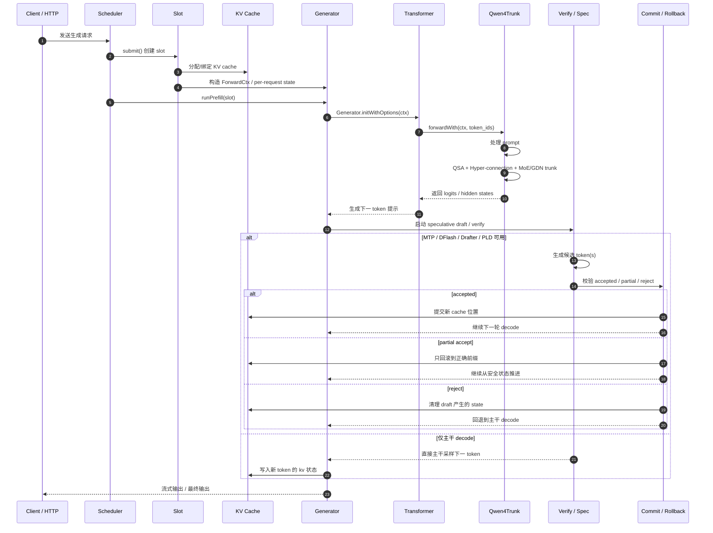
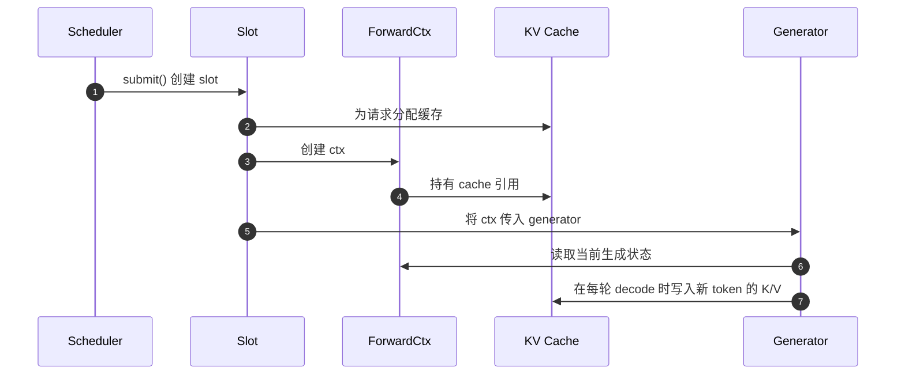
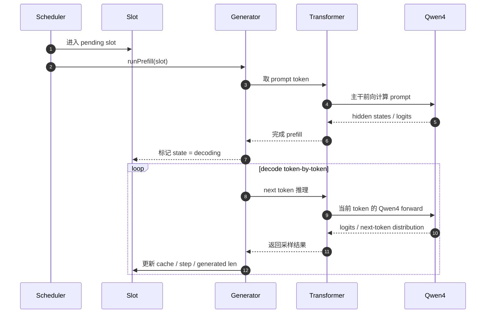
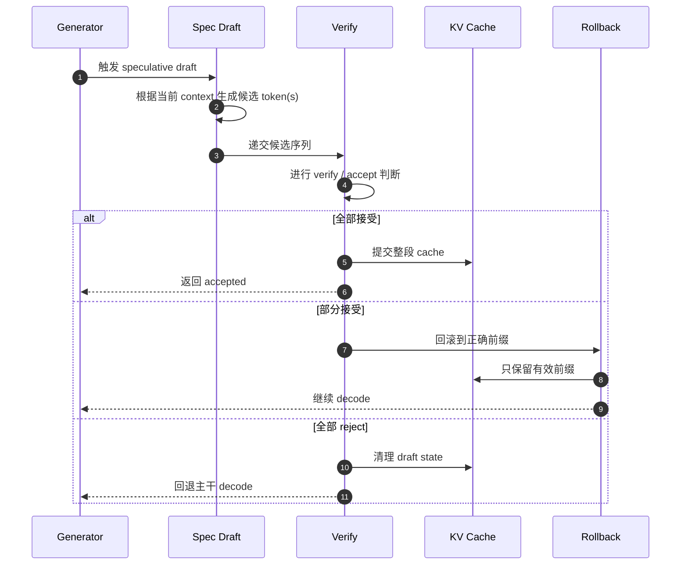

# Qwen4 + Scheduler + KV Cache 的源码时序图版（中文）

这篇文档把前面几篇架构总结进一步落成一张“运行时顺序图”，重点回答：

- 一个请求是如何进入 scheduler 的
- slot 是怎样绑定 KV cache 的
- prefill 和 decode 在什么时刻切换
- Qwen4 主干前向在什么位置执行
- speculative / verify / rollback 是如何插进来的

核心 read path：

- [../src/scheduler.zig](../src/scheduler.zig)
- [../src/generate.zig](../src/generate.zig)
- [../src/qwen4_exp.zig](../src/qwen4_exp.zig)
- [../src/transformer.zig](../src/transformer.zig)
- [../src/mtp.zig](../src/mtp.zig)
- [../src/dflash.zig](../src/dflash.zig)

---

## 一、总时序：请求 → slot → KV cache → Qwen4 → decode



---

## 二、对应源码层次的语义分解

这张图并不是“概念图”，而是直接映射到源码层：

```text
Client
  -> Scheduler.submit()
      -> Slot.init()
          -> KVCache.initWithConfigAndHeadDim()
          -> ForwardCtx 绑定当前 slot state
      -> runPrefill(slot)
          -> Generator.initWithOptions(ctx)
          -> Transformer.forwardWith(ctx, prompt_tokens)
              -> forwardQwen4With(...)
                  -> QSA / Hyper Stream / GDN / MoE
          -> slot.state = decoding
      -> Generator.next() / runDecodeTick()
          -> speculative draft / verify / commit / rollback
          -> 更新 KV cache
```

---

## 三、最关键的一段：slot 与 KV cache 的绑定



这里非常关键：

- `Slot` 不是只存“请求参数”
- `Slot` 真正持有的是“本轮生成的 live state”
- `KV cache` 是那份 live state 的核心容器
- `ForwardCtx` 是两者之间的桥接对象

这也解释了为什么 Qwen4 runtime 的大部分状态都不是全局单例，而是 slot-scoped。

---

## 四、prefill 与 decode 的时序切换



这里的状态转换非常重要：

```text
pending_prefill -> decoding
```

也就是说，真正的“模型开始生成 token”不在 request 进入的一开始，而是在 prefill 已经把上下文状态装好之后。

---

## 五、speculative draft 和 verify 的插入时序



从中可以看出：

- spec draft 并不是独立输出最终答案
- 它只是给主干提供一个“候选未来序列”
- 真正决定生成是否正确的，是 verify + rollback 这条线

---

## 六、把它压成一句最短描述

```text
Client -> Scheduler.submit -> Slot.init -> KVCache.bind -> runPrefill -> Generator.init -> Transformer.forward -> Qwen4Trunk -> decode loop -> speculative verify -> commit or rollback -> next token
```

---

## 七、总结

Qwen4 + Scheduler + KV Cache 的真正运行时序，不是“单模型直接输出 token”，而是：

1. 请求进入 scheduler
2. 创建 slot 并绑定 KV cache
3. prefill 完成上下文状态建立
4. Qwen4 主干开始前向
5. decode loop 逐 token 生成
6. speculative draft / verify 在中间插入
7. 成功则 commit，失败则 rollback
8. 继续推进下一轮生成

这条时序也正是 mlx-serve 里 Qwen4 runtime 的核心骨架。
