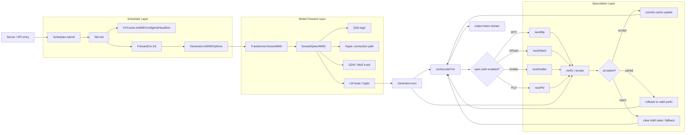

# Qwen4 源码函数名对照总图（中文）

这版文档的目标是把“架构总图”再落一层到“源码函数名”上。它不是泛泛而谈，而是直接把最关键的函数名按运行时顺序串起来：

- 入口在哪里
- slot 是怎么建起来的
- KV cache 是怎么绑上的
- prefill 和 decode 各走哪个函数
- Qwen4 trunk 的前向入口是什么
- speculative 验证/回滚 的断点在哪里

---

## 一、源码函数名总图



---

## 二、对照关系：函数名 ↔ 角色

### 1. Scheduler 层

- `Scheduler.submit`
  - request 进入调度器的入口
  - 创建 slot，并把其放入 pending / active 流程

- `Slot.init`
  - 建立 per-request 运行状态
  - 绑定 KV cache 和 `ForwardCtx`

- `KVCache.initWithConfigAndHeadDim`
  - 真正分配和初始化 cache

- `runPrefill`
  - prompt 的 prefill 阶段入口
  - 触发 generator 构造和前向启动

### 2. Generator / Transformer 层

- `Generator.initWithOptions`
  - 把 `ctx` + transformer + sampling 状态绑定起来

- `Transformer.forwardWith`
  - 统一前向入口

- `forwardQwen4With`
  - Qwen4 的真正主前向实现

- `Generator.next`
  - next-token 生成的核心逻辑

- `runDecodeTick`
  - scheduler 侧 decode tick 的调度入口

### 3. Speculative 层

- `nextMtp`
- `nextDflash`
- `nextDrafter`
- `nextPld`

这些函数都是“候选 token 生成器”，它们在 decode 阶段插入 spec-draft 分支。

随后落到：

- `verify / accept`
- `rollback`
- `commit cache update`

来决定这批候选到底要不要留在 cache 中。

---

## 三、最短源码链路

```text
Scheduler.submit
  -> Slot.init
      -> KVCache.initWithConfigAndHeadDim
      -> ForwardCtx init
  -> runPrefill
      -> Generator.initWithOptions
      -> Transformer.forwardWith
          -> forwardQwen4With
  -> Generator.next
      -> runDecodeTick
      -> nextMtp / nextDflash / nextDrafter / nextPld
      -> verify / accept / rollback
      -> commit or fallback
```

---

## 四、最关键的几处断点

### 断点 1：slot 生成

```text
Scheduler.submit -> Slot.init
```

这一步决定请求是否真正拥有独立的生成状态。

### 断点 2：KV cache 绑定

```text
Slot.init -> KVCache.initWithConfigAndHeadDim -> ForwardCtx
```

这是生成状态的核心落点：后续所有 token 都写入这里。

### 断点 3：Qwen4 前向入口

```text
Generator.initWithOptions -> Transformer.forwardWith -> forwardQwen4With
```

这是主干模型真正开始工作的位置。

### 断点 4：decode / speculative

```text
Generator.next -> runDecodeTick -> nextMtp / nextDflash / nextDrafter / nextPld -> verify -> commit/rollback
```

这是整个“下一个 token 是怎么决策”的关键时刻。

---

## 五、最终结论

最直观的源码结论是：

> `scheduler` 负责请求生命周期；`slot` 负责 live state；`KV cache` 负责历史上下文；`transformer` 和 `forwardQwen4With` 负责主干计算；`nextMtp / nextDflash / nextDrafter / nextPld` 负责 speculative draft；`verify + rollback + commit` 决定最终是否接受这批 token。

这套函数名结构，本质上就是 mlx-serve 的 Qwen4 运行时骨架。
